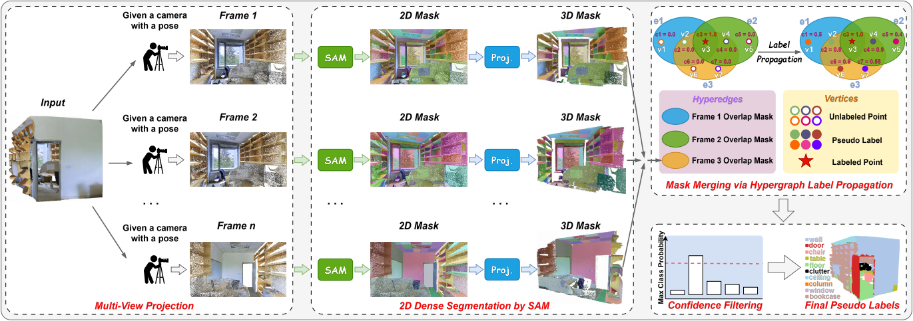

# SAM-Guided Multi-View Fusion for Weakly Supervised 3D Point Cloud Segmentation

This repository contains the implementation of our weakly supervised 3D point cloud semantic segmentation framework. The method leverages SAM-based multi-view cues and hypergraph label propagation (HLP) to generate pseudo-labels, which are then used to train 3D semantic segmentation networks.

<p align="center">
  
</p>

<p align="center">
  Overview of the proposed SAM-guided multi-view fusion framework.
</p>

The overall pipeline is illustrated using ScanNet as an example. The main steps include:

1. Generate geometric hyperedges and SAM hyperedges.
2. Perform hypergraph label propagation (HLP).
3. Generate final pseudo labels.
4. Use the generated pseudo labels to train the segmentation network.


---
## ScanNet

For ScanNet, the pseudo-label generation process is as follows.

First, generate the geometric hyperedges and SAM hyperedges using the scripts in the `Scannet` folder:

```bash
python Scannet/generate_scannet_geometric_hyperedges.py
python Scannet/generate_scannet_sam_hyperedges.py
```

Then run hypergraph label propagation:

```bash
python Scannet/Scannet_hlp.py
```

After obtaining the HLP results, generate the final pseudo labels:

```bash
python Scannet/generate_scannet_pseudo_labels.py
```

The generated pseudo labels are then used as training labels for the PTv2 semantic segmentation network.

---

## Training ScanNet with PTv2

The PTv2 segmentation network is configured based on the official [Point Transformer V2](https://github.com/Pointcept/PointTransformerV2) implementation.

In our implementation, the contents of the `pcr` folder in the official PTv2 repository should be replaced with the `pointcept` folder provided in this repository.

The ScanNet training configuration follows:

```text
configs/scannet/semseg-pt-v2m2-0-base.py
```

The training dataset path is also set in this configuration file. Please modify it according to the location of the generated pseudo-label training data.

Before training PTv2, run the following preprocessing scripts:

```bash
python PTv2/pointcept/datasets/preprocessing/scannet/preprocess_scannet_HLP_labels.py
python PTv2/pointcept/datasets/preprocessing/scannet/create_la_files.py
```

After preprocessing, the pseudo-label training data can be loaded by PTv2 for semantic segmentation training.

---

## S3DIS

The S3DIS pipeline follows a similar procedure to ScanNet: generate hyperedges, perform HLP, generate pseudo labels, and then train a segmentation network using the generated pseudo labels.

For S3DIS, the 2D views corresponding to point cloud scenes are rendered using Open3D:

```bash
python S3DIS/generate_s3dis_2D_views.py
```

The geometric hyperedges are generated following the idea of [Superpoint Graph](https://github.com/loicland/superpoint_graph):

```bash
python S3DIS/generate_s3dis_geometric_hyperedges.py
```

After generating the S3DIS HLP pseudo labels, they are used to train the DGCNN semantic segmentation network.

The DGCNN framework is configured based on the official [DGCNN PyTorch](https://github.com/antao97/dgcnn.pytorch#point-cloud-semantic-segmentation-on-the-s3dis-dataset) implementation.

In the official DGCNN repository, replace the following files with the corresponding files provided in this repository:

```text
prepare_data/collect_indoor3d_data.py
prepare_data/indoor3d_util.py
```

After that, run:

```bash
python prepare_data/gen_indoor3d_h5.py
```

After generating the HDF5 files, copy `all_files.txt` to the corresponding pseudo-label data folder:

```text
s3dis_hdf5_data_{y_hat_exp_name}/
```

Then run:

```bash
python Change_hdf5_all_files.py
```

This script updates `all_files.txt` so that the generated pseudo-label dataset can be correctly loaded.

Finally, modify the training data path in `data.py`:

```python
def load_data_semseg(partition, test_area):
    ...
    if partition == 'train':
        data_dir = os.path.join(DATA_DIR, 's3dis_hdf5_data_{exp_name}')
```

Please replace `{exp_name}` with the actual pseudo-label experiment name.

The pseudo-label training weight can be controlled in `util.py` through the `cal_loss` function.

---

## Citation

If you find this repository useful in your research, please consider citing our paper:

```bibtex
@INPROCEEDINGS{qiao2026samguided,
  author={Qiao, Yuena and Liu, Nanqing and Su, Yongyi and Li, Shijie and Yang, Xulei and Wen, Bihan and Chen, Nancy and Li, Tianrui and Xu, Xun},
  booktitle={ICASSP 2026 - 2026 IEEE International Conference on Acoustics, Speech and Signal Processing (ICASSP)},
  title={SAM-Guided Multi-View Fusion for Weakly Supervised 3D Point Cloud Segmentation},
  year={2026},
  pages={10392--10396},
  doi={10.1109/ICASSP55912.2026.11462621}
}
```

---

## Acknowledgements

This repository is built upon several excellent open-source projects, including [Segment Anything](https://github.com/facebookresearch/segment-anything), [Point Transformer V2](https://github.com/Pointcept/PointTransformerV2), [DGCNN PyTorch](https://github.com/antao97/dgcnn.pytorch), and [Superpoint Graph](https://github.com/loicland/superpoint_graph). We sincerely thank the authors for their great work.

